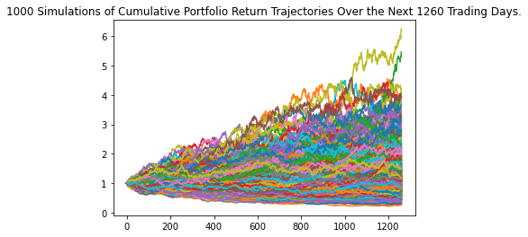
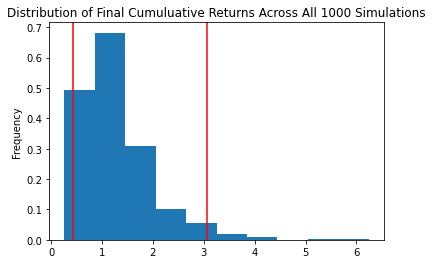

# Monte_Carlo_Stock_Simulation
Using the Alpaca API  to query the database for 5 years of data of daily stock returns for a hypothetical portfolio, Monte Carlo simulation of 1,000 simluations. Then visualizing the simulations.
 
 
 

<table>
<tr>
<th> Simulation Plot </th>
<th> Distrubtion Plot</th>
</tr>
<tr>
<td>

</td>
<td>

</td>
</tr>
</table

<!-- 

  

  
  

    

  
  

 -->
<!-- 
 
 -->
