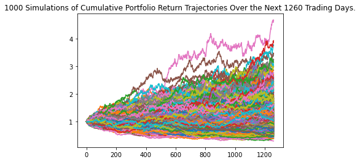
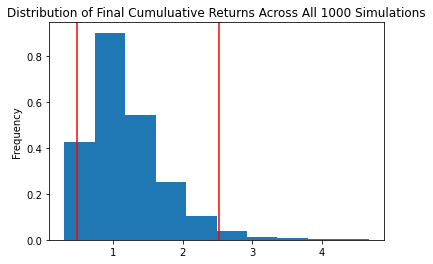
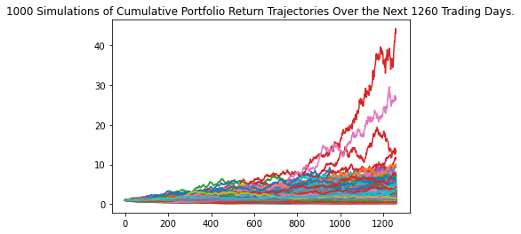
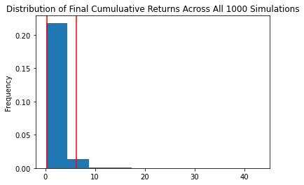

# Monte_Carlo_Stock_Simulation
Using the Alpaca API  to query the database for 5 years of data of daily stock returns for a hypothetical portfolio, Monte Carlo simulation of 1,000 simluations. Then visualizing the simulations.
 
 

### Equal weighted portfolio
<!-- 

  

    
  

  

    
  

 -->
<!--  |  -->

  
   

### AT&T 60% Weight

  
   

### Nike 60% Weight

  
   

### Exxon 60% Weight

  
   

